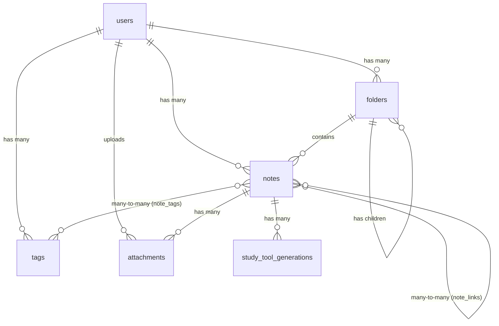
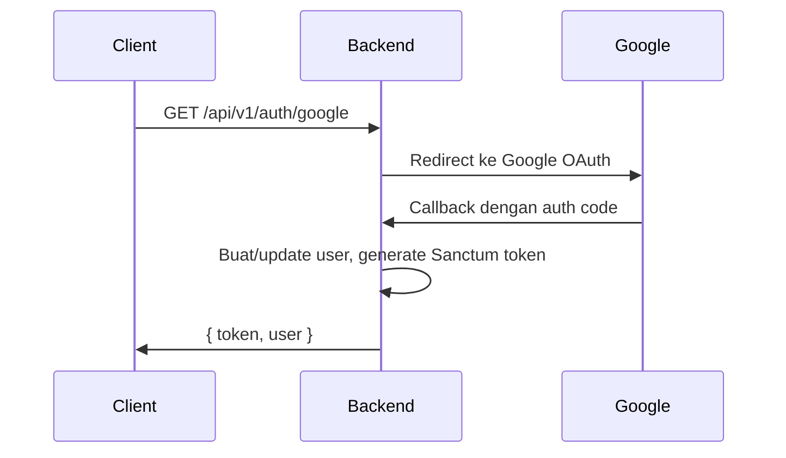

# 📘 Sinapsis Backend — API Documentation

> **Version**: 1.0 · **Framework**: Laravel 12 · **PHP**: 8.2 · **Database**: PostgreSQL (Supabase)

---

## Table of Contents

- [Overview](#overview)
- [Tech Stack](#tech-stack)
- [Architecture](#architecture)
- [Database Schema](#database-schema)
- [Authentication](#authentication)
- [API Reference](#api-reference)
  - [Auth](#1-auth)
  - [Notes](#2-notes)
  - [Folders](#3-folders)
  - [Tags](#4-tags)
  - [Note Links](#5-note-links)
  - [Attachments](#6-attachments)
  - [Public Sharing](#7-public-sharing)
- [Error Handling](#error-handling)
- [Environment Variables](#environment-variables)
- [Project Structure](#project-structure)

---

## Overview

**Sinapsis** adalah aplikasi pencatatan cerdas (smart note-taking) yang mendukung fitur organisasi folder, tagging, bi-directional linking antar catatan, berbagi catatan secara publik, dan lampiran file yang disimpan di Supabase Storage.

## Tech Stack

| Layer | Technology |
|---|---|
| Framework | Laravel 12 |
| Auth | Laravel Sanctum (Token-based) + Google OAuth via Socialite |
| Database | PostgreSQL hosted on Supabase |
| File Storage | Supabase Storage (S3-compatible) |
| DTO / Validation | `spatie/laravel-data` v4 |
| Primary Keys | UUID v7 (`HasUuids` trait) |

## Architecture

Proyek ini mengikuti pola arsitektur **Thin Controller** dengan lapisan-lapisan berikut:

```
Request → Route → Controller → Policy (Authorization) → DTO (Validation) → Model (Eloquent) → Response (DTO)
```

### Prinsip Utama

1.  **Thin Controllers**: Controller hanya bertugas sebagai penghubung (orchestrator). Tidak ada logika bisnis kompleks di dalamnya.
2.  **Typed DTOs (`spatie/laravel-data`)**: Semua input divalidasi melalui `StoreXxxData` / `UpdateXxxData`. Semua output diserialisasi melalui `XxxData::fromModel()`.
3.  **Laravel Policies**: Setiap aksi yang sensitif (view, update, delete) dilindungi oleh Policy yang memastikan **isolasi data antar pengguna**.
4.  **Scoped Queries**: Semua query menggunakan `scopeForUser()` untuk menjamin pengguna hanya bisa mengakses data miliknya sendiri.

### Struktur Direktori Utama

```
app/
├── Data/                    # DTO Layer (spatie/laravel-data)
│   ├── Attachment/
│   │   ├── AttachmentData.php
│   │   └── StoreAttachmentData.php
│   ├── Folder/
│   │   ├── FolderData.php
│   │   ├── StoreFolderData.php
│   │   └── UpdateFolderData.php
│   ├── Note/
│   │   ├── NoteData.php
│   │   ├── StoreNoteData.php
│   │   └── UpdateNoteData.php
│   ├── NoteLink/
│   │   ├── NoteLinkData.php
│   │   └── StoreNoteLinkData.php
│   ├── Tag/
│   │   ├── StoreTagData.php
│   │   ├── TagData.php
│   │   └── UpdateTagData.php
│   └── User/
│       ├── UpdateUserData.php
│       └── UserData.php
├── Http/
│   └── Controllers/
│       ├── AttachmentController.php
│       ├── AuthController.php
│       ├── FolderController.php
│       ├── NoteController.php
│       ├── NoteLinkController.php
│       ├── ShareController.php
│       └── TagController.php
├── Models/
│   ├── Attachment.php
│   ├── Folder.php
│   ├── Note.php
│   ├── NoteLink.php
│   ├── Tag.php
│   └── User.php
└── Policies/
    ├── AttachmentPolicy.php
    ├── FolderPolicy.php
    ├── NoteLinkPolicy.php
    ├── NotePolicy.php
    └── TagPolicy.php
```

---

## Database Schema

### Entity Relationship Diagram



### Table: `users`

| Column | Type | Constraints |
|---|---|---|
| `user_id` | UUID | **PK** |
| `name` | VARCHAR(255) | NOT NULL |
| `email` | VARCHAR(255) | UNIQUE, NOT NULL |
| `image` | VARCHAR(255) | NULLABLE |
| `google_id` | VARCHAR(255) | NULLABLE |
| `last_opened_note_id` | UUID | NULLABLE, FK → notes.id |
| `remember_token` | VARCHAR(100) | NULLABLE |
| `created_at` | TIMESTAMP | |
| `updated_at` | TIMESTAMP | |

### Table: `folders`

| Column | Type | Constraints |
|---|---|---|
| `id` | UUID | **PK** |
| `user_id` | UUID | FK → users.user_id, CASCADE DELETE |
| `parent_id` | UUID | NULLABLE, FK → folders.id (self-referencing), CASCADE DELETE |
| `name` | VARCHAR(255) | NOT NULL |
| `created_at` | TIMESTAMP | |
| `updated_at` | TIMESTAMP | |

### Table: `notes`

| Column | Type | Constraints |
|---|---|---|
| `id` | UUID | **PK** |
| `user_id` | UUID | FK → users.user_id, CASCADE DELETE |
| `folder_id` | UUID | NULLABLE, FK → folders.id, NULL ON DELETE |
| `title` | VARCHAR(255) | DEFAULT 'Untitled' |
| `content` | TEXT | NULLABLE |
| `is_published` | BOOLEAN | DEFAULT false |
| `share_token` | VARCHAR(64) | UNIQUE, NULLABLE |
| `deleted_at` | TIMESTAMP | NULLABLE (Soft Deletes) |
| `created_at` | TIMESTAMP | |
| `updated_at` | TIMESTAMP | |

### Table: `tags`

| Column | Type | Constraints |
|---|---|---|
| `id` | UUID | **PK** |
| `user_id` | UUID | FK → users.user_id, CASCADE DELETE |
| `name` | VARCHAR(100) | UNIQUE per user (`user_id`, `name`) |
| `color` | VARCHAR(7) | NULLABLE (Hex color code) |
| `created_at` | TIMESTAMP | |
| `updated_at` | TIMESTAMP | |

### Table: `note_tags` (Pivot)

| Column | Type | Constraints |
|---|---|---|
| `note_id` | UUID | FK → notes.id, CASCADE DELETE |
| `tag_id` | UUID | FK → tags.id, CASCADE DELETE |
| | | **PK** (`note_id`, `tag_id`) |

### Table: `note_links`

| Column | Type | Constraints |
|---|---|---|
| `id` | UUID | **PK** |
| `source_note` | UUID | FK → notes.id, CASCADE DELETE |
| `target_note` | UUID | FK → notes.id, CASCADE DELETE |
| `created_at` | TIMESTAMP | |
| `updated_at` | TIMESTAMP | |
| | | UNIQUE (`source_note`, `target_note`) |

### Table: `attachments`

| Column | Type | Constraints |
|---|---|---|
| `id` | UUID | **PK** |
| `note_id` | UUID | FK → notes.id, CASCADE DELETE |
| `user_id` | UUID | FK → users.user_id, CASCADE DELETE |
| `file_url` | TEXT | NOT NULL |
| `file_name` | VARCHAR(255) | NOT NULL |
| `file_type` | VARCHAR(100) | NULLABLE |
| `file_size` | INTEGER | NULLABLE (bytes) |
| `created_at` | TIMESTAMP | |
| `updated_at` | TIMESTAMP | |

### Table: `study_tool_generations`

| Column | Type | Constraints |
|---|---|---|
| `id` | UUID | **PK** |
| `note_id` | UUID | FK → notes.id, CASCADE DELETE |
| `user_id` | UUID | FK → users.user_id, CASCADE DELETE |
| `type` | ENUM | `flashcard`, `quiz`, `mindmap` |
| `content` | JSON | NOT NULL |
| `image_url` | TEXT | NULLABLE |
| `status` | ENUM | `pending`, `completed`, `failed` (DEFAULT `pending`) |
| `created_at` | TIMESTAMP | |
| `updated_at` | TIMESTAMP | |

---

## Authentication

Sinapsis menggunakan **Google OAuth 2.0** untuk login dan **Laravel Sanctum** untuk token-based API authentication.

### Flow Autentikasi



### Cara Menggunakan Token

Setelah login, sertakan token di **Header** setiap request:

```
Authorization: Bearer 1|QWertyUiOpAsdfGhJkLzXcVbNm...
```

---

## API Reference

> **Base URL**: `http://127.0.0.1:8000/api/v1`
>
> Semua endpoint (kecuali Auth OAuth dan Public Sharing) memerlukan header `Authorization: Bearer {token}`.

---

### 1. Auth

#### `GET /auth/google` 🔓
Redirect ke halaman login Google OAuth.

#### `GET /auth/google/callback` 🔓
Callback dari Google. Mengembalikan token Sanctum dan data user.

**Response** `200`:
```json
{
  "token": "1|abc123...",
  "user": {
    "user_id": "uuid",
    "name": "John Doe",
    "email": "john@gmail.com",
    "image": "https://...",
    "last_opened_note_id": null,
    "created_at": "2026-04-03T07:01:44.000000Z",
    "updated_at": "2026-04-03T07:01:44.000000Z"
  }
}
```

#### `POST /auth/logout` 🔒
Menghapus token akses saat ini.

**Response**: `204 No Content`

#### `GET /auth/me` 🔒
Mendapatkan profil pengguna yang sedang login.

**Response** `200`: Objek `UserData`

#### `PATCH /auth/me` 🔒
Memperbarui profil pengguna.

| Field | Type | Rules |
|---|---|---|
| `name` | string | optional, max 255 |
| `image` | string | optional, nullable |

**Response** `200`: Objek `UserData` yang diperbarui

#### `PATCH /auth/me/last-opened` 🔒
Menyimpan catatan terakhir yang dibuka.

| Field | Type | Rules |
|---|---|---|
| `note_id` | string (UUID) | required, exists in notes |

**Response**: `204 No Content`

---

### 2. Notes

#### `GET /notes` 🔒
Mendapatkan semua catatan milik pengguna.

**Query Parameters:**

| Param | Type | Description |
|---|---|---|
| `folder_id` | UUID | Filter berdasarkan folder |
| `search` | string | Cari berdasarkan judul (LIKE) |
| `trash` | boolean | Jika `true`, tampilkan hanya catatan yang di-*soft delete* |

**Response** `200`: Array of `NoteData`

#### `POST /notes` 🔒
Membuat catatan baru.

| Field | Type | Rules |
|---|---|---|
| `title` | string | **required**, max 255 |
| `content` | string | optional, nullable |
| `folder_id` | UUID | optional, nullable, must exist in `folders` |
| `is_published` | boolean | default `false` |

**Response** `201`: Objek `NoteData`

#### `GET /notes/{note}` 🔒
Mendapatkan detail catatan beserta tags, backlinks, dan outgoing links.

**Response** `200`:
```json
{
  "id": "uuid",
  "user_id": "uuid",
  "folder_id": "uuid | null",
  "title": "Judul Catatan",
  "content": "Isi catatan...",
  "is_published": false,
  "share_token": null,
  "deleted_at": null,
  "created_at": "2026-04-03T07:13:57.000000Z",
  "updated_at": "2026-04-03T07:13:57.000000Z",
  "tags": [],
  "backlinks": [],
  "outgoing_links": [],
  "share_url": null
}
```

#### `PATCH /notes/{note}` 🔒
Memperbarui catatan.

| Field | Type | Rules |
|---|---|---|
| `title` | string | optional, max 255 |
| `content` | string | optional, nullable |
| `folder_id` | UUID | optional, nullable, must exist in `folders` |
| `is_published` | boolean | optional |

**Response** `200`: Objek `NoteData`

#### `DELETE /notes/{note}` 🔒
Soft delete catatan (pindah ke trash).

**Response**: `204 No Content`

#### `PATCH /notes/{id}/restore` 🔒
Mengembalikan catatan dari trash.

**Response** `200`: Objek `NoteData`

#### `DELETE /notes/{id}/force` 🔒
Menghapus catatan secara permanen (tidak bisa dikembalikan).

**Response**: `204 No Content`

#### `POST /notes/{note}/share` 🔒
Generate `share_token` dan publikasikan catatan. Jika token sudah ada, token lama tetap digunakan.

**Response** `200`: Objek `NoteData` dengan `share_url` yang terisi.

#### `DELETE /notes/{note}/share` 🔒
Unpublish catatan dan hapus `share_token`.

**Response** `200`: Objek `NoteData`

#### `POST /notes/{note}/tags/{tag}` 🔒
Menambahkan tag ke catatan.

**Response**: `204 No Content`

#### `DELETE /notes/{note}/tags/{tag}` 🔒
Menghapus tag dari catatan.

**Response**: `204 No Content`

---

### 3. Folders

#### `GET /folders` 🔒
Mendapatkan semua folder root milik pengguna (termasuk children secara rekursif / nested tree).

**Response** `200`:
```json
[
  {
    "id": "uuid",
    "user_id": "uuid",
    "parent_id": null,
    "name": "Folder Utama",
    "created_at": "...",
    "updated_at": "...",
    "children": [
      {
        "id": "uuid",
        "parent_id": "parent-uuid",
        "name": "Sub Folder",
        "children": []
      }
    ]
  }
]
```

#### `POST /folders` 🔒
Membuat folder baru.

| Field | Type | Rules |
|---|---|---|
| `name` | string | **required**, max 255 |
| `parent_id` | UUID | optional, nullable |

**Response** `201`: Objek `FolderData`

#### `PATCH /folders/{folder}` 🔒
Memperbarui nama atau parent folder.

| Field | Type | Rules |
|---|---|---|
| `name` | string | optional, max 255 |
| `parent_id` | UUID | optional, nullable |

**Response** `200`: Objek `FolderData`

#### `DELETE /folders/{folder}` 🔒
Menghapus folder (cascade ke children).

**Response**: `204 No Content`

---

### 4. Tags

#### `GET /tags` 🔒
Mendapatkan semua tag milik pengguna.

**Response** `200`: Array of `TagData`
```json
[
  { "id": "uuid", "user_id": "uuid", "name": "Important", "color": "#FF5733" }
]
```

#### `POST /tags` 🔒
Membuat tag baru.

| Field | Type | Rules |
|---|---|---|
| `name` | string | **required**, max 100 |
| `color` | string | optional, nullable, max 7 (hex: `#FFFFFF`) |

**Response** `201`: Objek `TagData`

#### `PATCH /tags/{tag}` 🔒
Memperbarui tag.

**Response** `200`: Objek `TagData`

#### `DELETE /tags/{tag}` 🔒
Menghapus tag.

**Response**: `204 No Content`

---

### 5. Note Links

Fitur **Bi-directional Linking** antar catatan (Backlinks & Outgoing Links).

#### `GET /notes/{note}/backlinks` 🔒
Mendapatkan semua catatan yang mereferensikan catatan ini.

**Response** `200`:
```json
{
  "backlinks": [
    { "id": "uuid", "title": "Catatan Lain", "..." : "..." }
  ]
}
```

#### `POST /notes/{note}/links` 🔒
Membuat link dari catatan ini ke catatan lain.

| Field | Type | Rules |
|---|---|---|
| `target_note` | UUID | **required** |

**Response** `201`: Objek `NoteLinkData`

#### `DELETE /notes/{note}/links/{target}` 🔒
Menghapus link antara dua catatan.

**Response**: `204 No Content`

---

### 6. Attachments

File disimpan di **Supabase Storage** (Bucket: `Attachment`) via protokol S3.

#### `GET /notes/{note}/attachments` 🔒
Mendapatkan semua lampiran dari sebuah catatan.

**Response** `200`:
```json
[
  {
    "id": "uuid",
    "note_id": "uuid",
    "file_url": "https://xxx.supabase.co/storage/v1/object/public/Attachment/...",
    "file_name": "gambar.png",
    "file_type": "image/png",
    "file_size": 204800,
    "created_at": "2026-04-06T05:30:00.000000Z"
  }
]
```

#### `POST /notes/{note}/attachments` 🔒
Upload file lampiran ke Supabase Storage.

| Field | Type | Rules |
|---|---|---|
| `file` | File (multipart) | **required**, max 10MB |

> **Content-Type**: `multipart/form-data`

**Response** `201`: Objek `AttachmentData`

#### `DELETE /attachments/{attachment}` 🔒
Menghapus lampiran dari database dan Supabase Storage.

**Response**: `204 No Content`

---

### 7. Public Sharing

#### `GET /shared/{token}` 🔓
Mengakses catatan yang dipublikasikan tanpa login. Token adalah string acak 64 karakter yang di-generate saat pemilik melakukan `POST /notes/{note}/share`.

**Response** `200`: Objek `NoteData` (termasuk tags dan backlinks)

**Response** `404`:
```json
{ "message": "Note not found or not published." }
```

---

## Error Handling

Semua error dikembalikan dalam format JSON secara konsisten.

| Status | Meaning | Contoh Penyebab |
|---|---|---|
| `401` | Unauthorized | Token tidak valid atau tidak ada |
| `403` | Forbidden | User bukan pemilik resource |
| `404` | Not Found | Resource tidak ditemukan |
| `422` | Unprocessable Entity | Validasi gagal (field tidak valid, FK tidak ditemukan) |
| `500` | Server Error | Error internal |

**Contoh Error Validasi** `422`:
```json
{
  "message": "The folder id field must exist.",
  "errors": {
    "folder_id": ["The folder id field must exist."]
  }
}
```

---

## Environment Variables

Variabel berikut **wajib** dikonfigurasi di file `.env`:

### Database (PostgreSQL / Supabase)
```env
DB_CONNECTION=pgsql
DB_HOST=aws-1-ap-southeast-1.pooler.supabase.com
DB_PORT=5432
DB_DATABASE=postgres
DB_USERNAME=postgres.xxxxx
DB_PASSWORD=your-password
DB_SSLMODE=prefer
```

### Google OAuth
```env
GOOGLE_CLIENT_ID=your-google-client-id
GOOGLE_CLIENT_SECRET=your-google-client-secret
GOOGLE_REDIRECT_URL=http://127.0.0.1:8000/auth/google/callback
```

### Supabase Storage (S3)
```env
SUPABASE_ACCESS_KEY_ID=your-s3-access-key
SUPABASE_SECRET_ACCESS_KEY=your-s3-secret-key
SUPABASE_REGION=ap-southeast-1
SUPABASE_BUCKET=Attachment
SUPABASE_ENDPOINT=https://your-project.supabase.co/storage/v1/s3
```

> **Catatan**: Kredensial S3 bisa didapatkan di **Supabase Dashboard → Settings → Storage → S3 Infrastructure**.

---

## Project Structure

```
sinapsis_backend/
├── app/
│   ├── Data/                   # Typed DTOs (spatie/laravel-data)
│   ├── Http/
│   │   ├── Controllers/        # Thin controllers
│   │   └── Middleware/
│   │       └── ForceJsonResponse.php
│   ├── Models/                 # Eloquent models (UUID-based)
│   ├── Policies/               # Authorization policies
│   └── Providers/
├── bootstrap/
│   └── app.php                 # Middleware & exception config
├── config/
│   └── filesystems.php         # Supabase S3 disk config
├── database/
│   └── migrations/             # All table migrations
├── routes/
│   └── api.php                 # All API route definitions
├── .env                        # Environment configuration
└── composer.json
```

### Key Design Decisions

| Decision | Rationale |
|---|---|
| UUID Primary Keys | Keamanan (tidak bisa ditebak), kompatibel dengan distributed systems |
| Custom `user_id` PK pada `users` | Konsistensi penamaan dengan kebutuhan proyek |
| Soft Deletes hanya pada `notes` | Fitur Trash hanya diperlukan untuk catatan |
| `spatie/laravel-data` sebagai DTO | Menggantikan FormRequest + API Resource dalam satu class |
| Supabase S3 disk terpisah | Memisahkan konfigurasi storage cloud dari storage default Laravel |
| `ForceJsonResponse` middleware | Memastikan semua response API selalu dalam format JSON |

---

> 📅 Dokumentasi ini terakhir diperbarui: **Mei 2026**
