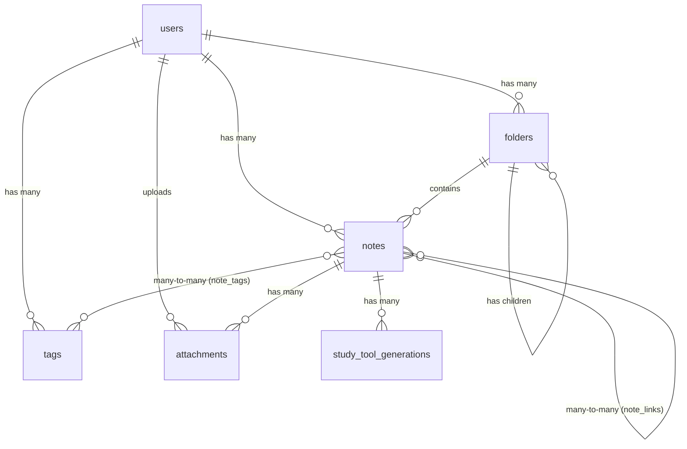

# 📘 Sinapsis Backend — API Documentation

> **Version**: 1.1 · **Framework**: Laravel 12 · **PHP**: 8.2 · **Database**: PostgreSQL (Supabase)

---

## Table of Contents

- [Overview](#overview)
- [Tech Stack](#tech-stack)
- [Architecture](#architecture)
- [Database Schema](#database-schema)
- [Authentication](#authentication)
- [Real-Time / WebSockets](#real-time--websockets)
- [API Reference](#api-reference)
  - [1. Auth](#1-auth)
  - [2. Notes](#2-notes)
  - [3. Folders](#3-folders)
  - [4. Tags](#4-tags)
  - [5. Note Links](#5-note-links)
  - [6. Attachments](#6-attachments)
  - [7. Study Tools](#7-study-tools)
  - [8. Public Sharing](#8-public-sharing)
- [Error Handling](#error-handling)
- [Environment Variables](#environment-variables)
- [Project Structure](#project-structure)

---

## Overview

**Sinapsis** adalah aplikasi pencatatan cerdas (smart note-taking) yang mendukung fitur organisasi folder, tagging, bi-directional linking antar catatan, berbagi catatan secara publik, lampiran file yang disimpan di Supabase Storage, sinkronisasi catatan *real-time*, dan *Study Tools* (Flashcards, Quiz, Mindmap).

## Tech Stack

| Layer | Technology |
|---|---|
| Framework | Laravel 12 |
| Auth | Laravel Sanctum (Token-based) + Google OAuth via Socialite |
| Database | PostgreSQL hosted on Supabase |
| File Storage | Supabase Storage (S3-compatible) |
| WebSockets | Laravel Reverb (Pusher compatible) |
| DTO / Validation | `spatie/laravel-data` v4 |
| Primary Keys | UUID v7 (`HasUuids` trait) |

## Architecture

Proyek ini mengikuti pola arsitektur **Thin Controller** dengan lapisan-lapisan berikut:

```
Request → Route → Controller → Policy (Authorization) → DTO (Validation) → Model (Eloquent) → Response (DTO)
```

### Prinsip Utama

1.  **Thin Controllers**: Controller hanya bertugas sebagai penghubung (orchestrator). Tidak ada logika bisnis kompleks di dalamnya.
2.  **Typed DTOs (`spatie/laravel-data`)**: Semua input divalidasi melalui `StoreXxxData` / `UpdateXxxData`. Semua output diserialisasi melalui `XxxData::fromModel()`.
3.  **Laravel Policies**: Setiap aksi yang sensitif (view, update, delete) dilindungi oleh Policy yang memastikan **isolasi data antar pengguna**.
4.  **Scoped Queries**: Semua query menggunakan `scopeForUser()` untuk menjamin pengguna hanya bisa mengakses data miliknya sendiri.

---

## Database Schema

### Entity Relationship Diagram



### Table: `users`
| Column | Type | Constraints |
|---|---|---|
| `user_id` | UUID | **PK** |
| `name` | VARCHAR(255) | NOT NULL |
| `email` | VARCHAR(255) | UNIQUE, NOT NULL |
| `image` | VARCHAR(255) | NULLABLE |
| `google_id` | VARCHAR(255) | NULLABLE |
| `last_opened_note_id` | UUID | NULLABLE, FK → notes.id |
| `remember_token` | VARCHAR(100) | NULLABLE |

### Table: `folders`
| Column | Type | Constraints |
|---|---|---|
| `id` | UUID | **PK** |
| `user_id` | UUID | FK → users.user_id, CASCADE DELETE |
| `parent_id` | UUID | NULLABLE, FK → folders.id (self-referencing), CASCADE DELETE |
| `name` | VARCHAR(255) | NOT NULL |

### Table: `notes`
| Column | Type | Constraints |
|---|---|---|
| `id` | UUID | **PK** |
| `user_id` | UUID | FK → users.user_id, CASCADE DELETE |
| `folder_id` | UUID | NULLABLE, FK → folders.id, NULL ON DELETE |
| `title` | VARCHAR(255) | DEFAULT 'Untitled' |
| `content` | TEXT | NULLABLE |
| `is_published` | BOOLEAN | DEFAULT false |
| `share_token` | VARCHAR(64) | UNIQUE, NULLABLE |
| `deleted_at` | TIMESTAMP | NULLABLE (Soft Deletes) |

### Table: `tags`
| Column | Type | Constraints |
|---|---|---|
| `id` | UUID | **PK** |
| `user_id` | UUID | FK → users.user_id, CASCADE DELETE |
| `name` | VARCHAR(100) | UNIQUE per user (`user_id`, `name`) |
| `color` | VARCHAR(7) | NULLABLE (Hex color code) |

### Table: `note_tags` (Pivot)
| Column | Type | Constraints |
|---|---|---|
| `note_id` | UUID | FK → notes.id, CASCADE DELETE |
| `tag_id` | UUID | FK → tags.id, CASCADE DELETE |
| | | **PK** (`note_id`, `tag_id`) |

### Table: `note_links`
| Column | Type | Constraints |
|---|---|---|
| `id` | UUID | **PK** |
| `source_note` | UUID | FK → notes.id, CASCADE DELETE |
| `target_note` | UUID | FK → notes.id, CASCADE DELETE |
| | | UNIQUE (`source_note`, `target_note`) |

### Table: `attachments`
| Column | Type | Constraints |
|---|---|---|
| `id` | UUID | **PK** |
| `note_id` | UUID | FK → notes.id, CASCADE DELETE |
| `user_id` | UUID | FK → users.user_id, CASCADE DELETE |
| `file_url` | TEXT | NOT NULL |
| `file_name` | VARCHAR(255) | NOT NULL |
| `file_type` | VARCHAR(100) | NULLABLE |
| `file_size` | INTEGER | NULLABLE (bytes) |

### Table: `study_tools` (or `study_tool_generations`)
| Column | Type | Constraints |
|---|---|---|
| `id` | UUID | **PK** |
| `note_id` | UUID | FK → notes.id, CASCADE DELETE |
| `user_id` | UUID | FK → users.user_id, CASCADE DELETE |
| `type` | ENUM | `flashcard`, `quiz`, `mindmap` |
| `content` | JSON | NOT NULL |
| `image_url` | TEXT | NULLABLE |
| `status` | ENUM | `pending`, `completed`, `failed` (DEFAULT `pending`) |

---

## Authentication

Sinapsis menggunakan **Google OAuth 2.0** untuk login dan **Laravel Sanctum** untuk token-based API authentication.

### Cara Menggunakan Token
Setelah login, sertakan token di **Header** setiap request:
```
Authorization: Bearer 1|QWertyUiOpAsdfGhJkLzXcVbNm...
```

---

## Real-Time / WebSockets

Sinapsis menggunakan **Laravel Reverb** untuk fitur sinkronisasi *real-time* seperti *whisper* (menampilkan saat pengguna sedang mengetik pada catatan yang sama di device lain).

Gunakan **Pusher JS / Laravel Echo** di sisi client untuk subscribe ke channel. 

**Kredensial Echo Client:**
- `broadcaster`: `reverb`
- `key`: `(Dari VITE_REVERB_APP_KEY)`
- `wsHost`: `(Domain aplikasi Backend)`
- `wsPort`: `8080` (Atau port default Reverb)
- `forceTLS`: `false` / `true` tergantung environment
- `authEndpoint`: `/api/broadcasting/auth` (dengan header Sanctum)

### 1. Channel Private: `App.Models.User.{user_id}`
Channel untuk event yang spesifik ke suatu pengguna.
- **Tipe**: Private Channel
- **Autentikasi**: Memastikan `$user->user_id === {user_id}`

### 2. Channel Private: `note.{noteId}`
Channel khusus untuk sinkronisasi sebuah catatan secara *real-time*. Digunakan untuk *Client-to-Client Whisper*.
- **Tipe**: Private / Presence Channel
- **Autentikasi**: Memastikan `$note->user_id === $user->user_id`
- **Whisper Events**:
  - `client-typing`: Dikirim saat user mengetik konten. Membawa payload `{ content: "..." }`. Client lain yang listen ke event ini dapat mengupdate UI tanpa perlu *request* ke database.

---

## API Reference

> **Base URL**: `http://127.0.0.1:8000/api/v1`
>
> Semua endpoint (kecuali Auth OAuth dan Public Sharing) memerlukan header `Authorization: Bearer {token}`.

---

### 1. Auth

#### `GET /auth/login` 🔓
Redirect ke halaman login Google OAuth.

#### `GET /auth/google/callback` 🔓
Callback dari Google. Mengembalikan token Sanctum dan data user.

**Response** `200`:
```json
{
  "token": "1|abc123...",
  "user": {
    "user_id": "uuid",
    "name": "John Doe",
    "email": "john@gmail.com",
    "image": "https://...",
    "last_opened_note_id": null
  }
}
```

#### `POST /auth/logout` 🔒
Menghapus token akses saat ini.
**Response**: `204 No Content`

#### `GET /auth/me` 🔒
Mendapatkan profil pengguna yang sedang login.
**Response** `200`: Objek `UserData`

#### `PATCH /auth/me` 🔒
Memperbarui profil pengguna.
| Field | Type | Rules |
|---|---|---|
| `name` | string | optional, max 255 |
| `image` | string | optional, nullable |

#### `PATCH /auth/me/last-opened` 🔒
Menyimpan catatan terakhir yang dibuka.
| Field | Type | Rules |
|---|---|---|
| `note_id` | string (UUID) | required, exists in notes |

---

### 2. Notes

#### `GET /notes` 🔒
Mendapatkan semua catatan milik pengguna.
**Query Parameters:**
| Param | Type | Description |
|---|---|---|
| `folder_id` | UUID | Filter berdasarkan folder |
| `search` | string | Cari berdasarkan judul (LIKE) |
| `trash` | boolean | Jika `true`, tampilkan hanya catatan yang di-*soft delete* |

#### `POST /notes` 🔒
Membuat catatan baru.
| Field | Type | Rules |
|---|---|---|
| `title` | string | **required**, max 255 |
| `content` | string | optional, nullable |
| `folder_id` | UUID | optional, nullable, must exist in `folders` |
| `is_published` | boolean | default `false` |

#### `GET /notes/{note}` 🔒
Mendapatkan detail catatan beserta tags, backlinks, dan outgoing links.

#### `PATCH /notes/{note}` 🔒
Memperbarui catatan.
| Field | Type | Rules |
|---|---|---|
| `title` | string | optional, max 255 |
| `content` | string | optional, nullable |
| `folder_id` | UUID | optional, nullable |
| `is_published` | boolean | optional |

#### `DELETE /notes/{note}` 🔒
Soft delete catatan (pindah ke trash).
**Response**: `204 No Content`

#### `PATCH /notes/{id}/restore` 🔒
Mengembalikan catatan dari trash.
#### `DELETE /notes/{id}/force` 🔒
Menghapus catatan secara permanen (tidak bisa dikembalikan).

#### `POST /notes/{note}/publish` 🔒
Generate `share_token` dan publikasikan catatan. Jika token sudah ada, token lama tetap digunakan.

#### `DELETE /notes/{note}/publish` 🔒
Unpublish catatan dan hapus `share_token`.

#### `POST /notes/{note}/tags/{tag}` 🔒
Menambahkan tag ke catatan.

#### `DELETE /notes/{note}/tags/{tag}` 🔒
Menghapus tag dari catatan.

---

### 3. Folders

#### `GET /folders` 🔒
Mendapatkan semua folder root milik pengguna (termasuk children secara rekursif / nested tree).
**Response** `200`: Array of nested `FolderData`

#### `POST /folders` 🔒
Membuat folder baru.
| Field | Type | Rules |
|---|---|---|
| `name` | string | **required**, max 255 |
| `parent_id` | UUID | optional, nullable |

#### `PATCH /folders/{folder}` 🔒
Memperbarui nama atau parent folder.

#### `DELETE /folders/{folder}` 🔒
Menghapus folder (cascade ke children).
**Response**: `204 No Content`

---

### 4. Tags

#### `GET /tags` 🔒
Mendapatkan semua tag milik pengguna.

#### `POST /tags` 🔒
Membuat tag baru.
| Field | Type | Rules |
|---|---|---|
| `name` | string | **required**, max 100 |
| `color` | string | optional, nullable, max 7 (hex: `#FFFFFF`) |

#### `PATCH /tags/{tag}` 🔒
Memperbarui tag.

#### `DELETE /tags/{tag}` 🔒
Menghapus tag.

---

### 5. Note Links

#### `GET /notes/{note}/backlinks` 🔒
Mendapatkan semua catatan yang mereferensikan catatan ini.

#### `POST /notes/{note}/links` 🔒
Membuat link dari catatan ini ke catatan lain.
| Field | Type | Rules |
|---|---|---|
| `target_note` | UUID | **required** |

#### `DELETE /notes/{note}/links/{target}` 🔒
Menghapus link antara dua catatan.

---

### 6. Attachments

File disimpan di **Supabase Storage** (Bucket: `Attachment`) via protokol S3.

#### `GET /notes/{note}/attachments` 🔒
Mendapatkan semua lampiran dari sebuah catatan.

#### `POST /notes/{note}/attachments` 🔒
Upload file lampiran ke Supabase Storage.
| Field | Type | Rules |
|---|---|---|
| `file` | File (multipart) | **required**, max 10MB |
> **Content-Type**: `multipart/form-data`

#### `DELETE /attachments/{attachment}` 🔒
Menghapus lampiran dari database dan Supabase Storage.

---

### 7. Study Tools

Fitur untuk membuat alat bantu belajar secara generatif (Flashcards, Quiz, Mindmap) dari catatan.

#### `GET /notes/{id}/study-tools` 🔒
Mengambil semua *Study Tools* milik suatu catatan.
**Query Parameters:**
| Param | Type | Description |
|---|---|---|
| `type` | string | Filter berdasarkan tipe (`flashcard`, `quiz`, `mindmap`) |

**Response** `200`: Array of `StudyToolData`

#### `POST /notes/{id}/study-tools` 🔒
Menyimpan *Study Tool* baru untuk suatu catatan.
| Field | Type | Rules |
|---|---|---|
| `note_id` | UUID | **required** (UUID dari catatan) |
| `type` | string | **required** (`flashcard`, `quiz`, `mindmap`) |
| `content` | JSON/Array | **required** (Konten dari study tool) |
| `status` | string | **required** (`pending`, `completed`, `failed`) |
| `image_url` | string | optional |

**Response** `200`: Objek `StudyToolData` baru

#### `GET /study-tools/{id}` 🔒
Mengambil satu *Study Tool* secara spesifik berdasarkan `note_id` dan `type`.
**Query Parameters:**
| Param | Type | Description |
|---|---|---|
| `note_id` | string | **required** |
| `type` | string | **required** (`flashcard`, `quiz`, `mindmap`) |

**Response** `200`: Objek `StudyToolData` tunggal

---

### 8. Public Sharing

#### `GET /shared/{token}` 🔓
Mengakses catatan yang dipublikasikan tanpa login. Token adalah string acak 64 karakter yang di-generate saat pemilik melakukan `POST /notes/{note}/publish`.

**Response** `200`: Objek `NoteData` (termasuk tags dan backlinks)

---

## Error Handling

Semua error dikembalikan dalam format JSON secara konsisten.

| Status | Meaning | Contoh Penyebab |
|---|---|---|
| `401` | Unauthorized | Token tidak valid atau tidak ada |
| `403` | Forbidden | User bukan pemilik resource |
| `404` | Not Found | Resource tidak ditemukan |
| `422` | Unprocessable Entity | Validasi gagal (field tidak valid, FK tidak ditemukan) |
| `500` | Server Error | Error internal |

---

## Environment Variables

Variabel berikut **wajib** dikonfigurasi di file `.env`:

### Database (PostgreSQL / Supabase)
```env
DB_CONNECTION=pgsql
DB_HOST=aws-1-ap-southeast-1.pooler.supabase.com
DB_PORT=5432
DB_DATABASE=postgres
DB_USERNAME=postgres.xxxxx
DB_PASSWORD=your-password
DB_SSLMODE=prefer
```

### Google OAuth
```env
GOOGLE_CLIENT_ID=your-google-client-id
GOOGLE_CLIENT_SECRET=your-google-client-secret
GOOGLE_REDIRECT_URL=http://127.0.0.1:8000/api/auth/google/callback
```

### Supabase Storage (S3)
```env
SUPABASE_ACCESS_KEY_ID=your-s3-access-key
SUPABASE_SECRET_ACCESS_KEY=your-s3-secret-key
SUPABASE_REGION=ap-southeast-1
SUPABASE_BUCKET=Attachment
SUPABASE_ENDPOINT=https://your-project.supabase.co/storage/v1/s3
```

### Laravel Reverb (WebSockets)
```env
REVERB_APP_ID=my-app-id
REVERB_APP_KEY=my-app-key
REVERB_APP_SECRET=my-app-secret
REVERB_HOST="localhost"
REVERB_PORT=8080
REVERB_SCHEME=http
```

---

## Project Structure

```
sinapsis_backend/
├── app/
│   ├── Data/                   # Typed DTOs (spatie/laravel-data)
│   ├── Http/
│   │   ├── Controllers/        # Thin controllers
│   │   └── Middleware/
│   │       └── ForceJsonResponse.php
│   ├── Models/                 # Eloquent models (UUID-based)
│   ├── Policies/               # Authorization policies
│   └── Providers/
├── bootstrap/
│   └── app.php                 # Middleware & exception config
├── config/
│   └── filesystems.php         # Supabase S3 disk config
├── database/
│   └── migrations/             # All table migrations
├── routes/
│   ├── api.php                 # All API route definitions
│   └── channels.php            # WebSocket / Reverb broadcasting channels
├── .env                        # Environment configuration
└── composer.json
```
